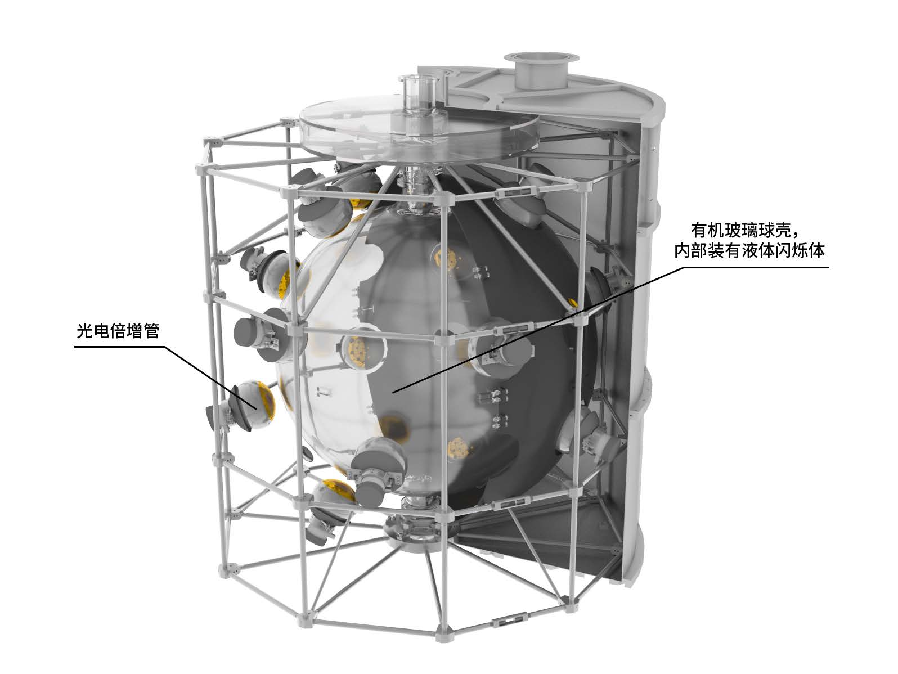
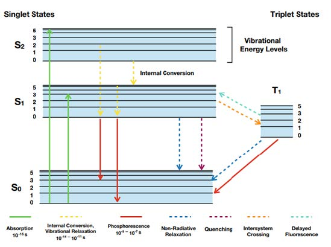

# α 粒子与 β 粒子入射的探测器响应模拟

提示：如果你无法渲染其中的公式，请阅读 `README.pdf`，两者内容相同。

## 大作业介绍

中微子是组成自然界的基本粒子之一，质量几乎为 0 ，以接近光速运动，每一秒钟就有数万亿中微子穿过每个人的身体。中微子只参与弱相互作用，与物质的相互作用十分微弱，很难探测，因此被称为幽灵粒子（Ghost Particle）。现在的探测方法，是借助中微子与物质偶然相互作用产生带电粒子，在探测器上沉积能量发出光子，进而通过光电倍增管（Photomultiplier，简称 PMT）接收光信号，产生电压波形。

在探测中微子信号的同时，探测器也会探测到一些典型带电粒子，例如 alpha 粒子和 beta 粒子等。在众多的粒子信号中，我们需要将不同的探测事例进行分析比对后，分别标记，本次的大作业，即是完成对 alpha 粒子和 beta 粒子的鉴别标记。

本次的大作业主要是完成模拟粒子入射，得到探测器的波形响应。

## 物理背景

### 锦屏中微子实验

中国锦屏地下实验室（China Jinping Underground Laboratory， CJPL）位于四川省雅砻江锦屏山的深处，是中国首个用于开展暗物质探测等国际前沿基础研究课题的极深地下实验室，于2010年12月12日正式投入使用。目前，CDEX、PandaX 等暗物质实验在这里进行，这些实验的研究水平已达到国际第一阵营。不仅仅是暗物质实验，未来的锦屏中微子实验也会在中国锦屏地下实验室开展，在太阳中微子、地球中微子、超新星遗迹中微子等学科前沿方面进行研究。
为了研究锦屏中微子实验所用到的液体闪烁体和低本底技术，我们在锦屏地下实验室中建造了一个小型原型机。其核心部件包括1吨液体闪烁体和30个光电倍增管（PMT）。高速运动的微观粒子在液体闪烁体中沉积能量，闪烁体会发出荧光，光电倍增管会将这些光信号转化为电信号输出。通过分析这30个光电倍增管上的电压波形，我们就可以得到原初粒子的能量、位置等信息，进而进行相关的物理分析。

探测器每次运行被称为一个 run，每个 run 中都包含了很多个触发事例（event）。我们记录下来的主要信息就是每个事例的触发时间戳，以及 30 个 PMT（编号从通道 0 到通道 29）上的波形。

### 电离

闪烁体需要发光，首先要吸收能量，能量主要来源于粒⼦的电离过程。电离过程是带电粒⼦损失能量的重要方式，可以用 Bethe 公式描述:

$$
{(\frac{dE}{dx})}_{\text{ion}}={({\frac{1}{{4}{\pi}{\epsilon}_0}})}^2{\frac{4{\pi}{e}^4{z}^2}{{{m_0}v}^2}}NB
$$

其中，$m$ 为电子的静止质量，$z$ 为入射粒子的电荷数，$v$ 为入射粒子速度，$N$ 是靶物质（液闪）单位体积的原子数。

$$
B=Z[\ln({\frac{2{m_0}{v}^2}{I}})-\ln(1-{\frac{{v}^2}{{c}^2}})-{\frac{{v}^2}{{c}^2}}]
$$

其中，$Z$ 为靶物质的原子的原子序数（因为液闪含有不同种类原子，因此需要将不同类原子分开计算，但是看成一种原子并不会影响最后的分析结果），$I$ 为靶物质（液闪）的平均激发和电离能。注意当接近相对论速度时，该项在增加，所以这一点也是非常重要的。

### 闪烁体

中微子探测器偏爱闪烁体探测器，中微子反应截面很小，因此探测器需要非常巨大，而液体闪烁体恰好符合这个要求。

闪烁体有很多类型，但是发光原理基本上一致。锦屏1吨原型探测器中使用液体闪烁体LAB（PPO），其中的苯环会形成π键。对应电子能级也会分成单态与三态。

在闪烁体发光的过程中，可以认为闪烁体的激发是瞬间完成的，但是退激发发射光子的过程是一个逐渐完成的过程，退激发发射光子的过程是一个满足指数衰减的概率过程，随着时间的增长，闪烁体退激发光放出的光子数会逐渐的减少。

当然，闪烁体退激发射的光子总数是固定的，但是随着传播距离的增加，进入到光电倍增管形成输出信号的光子数会大幅度减小，当光电倍增管距离发光点足够远时，就有可能会出现单个光子或者少量光子进入光电倍增管的情况。

### 粒子发光特点

对应的电荷更大，质量大，电离密度更高，因此产生光子密度更大，运动轨迹短并且偏转小。进入三线态概率更大，导致发光时间常数变长。

#### alpha 粒子

质量小，速度近光速，会产生切伦科夫光。对应的电荷小，质量小，电离密度小，单位距离能损较小，因此产生光子密度小。

#### beta 粒子

虽然单位距离能损较小，但是因为质量较小，因此电子反复散射轨迹曲折，最后行走距离不长。
进入三线态概率小，导致发光时间常数比 alpha粒子要短。

#### 切伦科夫光

如果带电粒子通过介质时的传播速度大于在介质中的光速时，会发出一种微弱的可见光，这种现象称为切伦科夫辐射。该过程通常可以分为两个阶段：首先是带电粒子引起透明的介质原子发生极化，然后激化原子退极化的过程中，会发射电磁辐射，这些电磁辐射会发生相干叠加而逐渐加强变量，形成切伦科夫辐射。

切伦科夫辐射具有一定的物理特性：

* 在一定的介质中发生切伦科夫辐射，对带电粒子有阈值速度的限制，例如对电子在介质中产生切伦科夫辐射的最低能量下限为：

$$
{E}_{\text{th}}={m}{c}^2(\sqrt{1+{\frac{1}{{n}^2}-1}}) \qquad \text{(MeV)}
$$
其中，$m$ 为电子的静止质量。

* 切伦科夫辐射是具有确定方向的，只在一定的圆锥角范围内发射。
* 切伦科夫辐射的辐射谱为连续的可见光谱。
* 切伦科夫辐射的发光时间短，发光强度比较弱。在常见的切伦科夫介质中，每个电子发射的光子对于每MeV的能量仅为几百个。这意味着带电粒子损失的能量中，仅有约千分之一转化为光辐射。

### 光电倍增管电压波形响应

当单个光子进入PMT时，形成的信号是由光电倍增管特性决定的一个信号响应，当射入到PMT的光子数比较多时，得到的波形则是由各个光子的波形响应叠加得到的一个波形，这条波形在数学表达上，可以理解为光电倍增管的单光子响应和闪烁体发射光子的概率分布的卷积形式。

入射到PMT的光子数比较多时，光电倍增管流过阳极回路的总电荷量：

$$
Q=E \cdot k \cdot T \cdot M \cdot e
$$

其中，E为闪烁体内沉积的能量，k为每MeV能量沉积发射光子量，T为转化因子，M为光电倍增管总的放大倍数。

得到最终的电压信号的脉冲响应为：

$$
V(t)={\frac{Q}{C}} \times {\frac{RC}{RC-{\tau}}} \times ({e}^{-{\frac{t}{RC}}}-{e}^{-{\frac{t}{\tau}}})
$$

其中，$R$，$C$ 为探测器输出回路的的等效电阻和等效电容，$\tau$ 为光子的时间衰减常数。

## 数据说明

所有的输入数据存放在 `data` 文件夹下，因此请不要随意改动这个文件夹下的内容。

`data.txt` 文件中存储了所有需要用到的输入参数，具体内容如下：

| Name        | Value    | Unit                |
| ----------- | -------- | ------------------- |
| E_alpha     | 10       | MeV                 |
| E_beta      | 1        | MeV                 |
| Z           | 246      | 相对原子质量        |
| I           | 0.0022   | MeV                 |
| N           | 1e21     | 每立方米            |
| c           | 3.0*10^8 | m/s                 |
| k           | 4300     | /MeV                |
| k_cherenkov | 100      | /MeV                |
| n_alpha1    | 0.8      | 慢成分比例          |
| n_alpha2    | 0.2      | 快成分比例          |
| n_beta1     | 0.1      | 慢成分比例          |
| n_beta2     | 0.9      | 快成分比例          |
| t_alpha1    | 30       | ns，慢成分衰减常数  |
| t_alpha2    | 4        | ns，快成分衰减常数  |
| t_beta1     | 30       | ns                  |
| t_beta2     | 4        | ns                  |
| d           | 1        | m，探测器直径       |
| n           | 1.5      | 液闪的折射率        |
| M           | 100000   | PMT总的倍增系数     |
| t0          | 50       | ns，PMT平均渡越时间 |
| T           | 1        | PMT转换因子         |
| C0          | 0.1      | pF，PMT等效电容     |
| R0          | 1        | kΩ，PMT等效电阻     |
| f           | 0.1      | PMT的覆盖率         |
| Np          | 30       | PMT数量             |

将data.txt文件进行分割，得到运行以下三个程序（`energy_deposition.py`，`light_spread.py`，`generate_response.py` ）所需要用到的输入文件：`im_energy_depoisition.txt`,`im_light_spread.txt`,`im_responce.txt`。

## 作业要求（功能部分）

功能部分作业占80分。

### Makefile

本次作业提供了 Makefile，最终助教也将使用 Makefile 进行测试。需要注意，你在编写所有程序文件时，都应该使用 make 给程序传入的参数（来自 `sys.argv`），而非硬编码下面提到的任何文件名等信息；否则，你可能无法通过测试。

在本目录中运行 `make -n` 即可看到实际运行的命令，这或许能帮助你开发。

### 基本要求

第一阶段的作业主要进行的是模拟探测器对 alpha 粒子和 beta 粒子的响应。可以大概分为以下三个步骤，完成每一个任务即可拿到相应的分数：

| 任务（程序名）         | 分数 |
| ---------------------- | ---- |
| `energy_deposition.py` | 30   |
| `light_spread.py`      | 10   |
| `generate_response.py` | 30   |
| `plot_waveform.py`     | 10   |

#### `energy_deposition.py`

读入 `im_energy_depoisition.txt`，输出 `num_light.csv`。

根据入射粒子的类型和能量，计算带电粒子的电离能量损失（Bethe 公式描述），以及发射光子的数量。这里我们做一个简化，认为带电粒子在运动过程中只在探测器球心出发生一次能量沉积，该粒子的沉积能量的长度取 1nm，且作为点源发射各向同性的光子。同时，你还需要判断该带电粒子是否发生切伦科夫辐射，并计算切伦科夫辐射的发射光子数，如果不发生切伦科夫辐射，则将发射切伦科夫光子数输出为 0。这里需要区分发射光子的快慢成分。经过该步骤应该得到一个包括以下内容的输出文件`num_light.csv`（保留两位有效数字）：

|       | num_fast | num_slow | num_cherenkov |
| ----- | -------- | -------- | ------------- |
| alpha |          |          |               |
| beta  |          |          |               |

其中三列分别为快成分、慢成分、切伦科夫辐射的光子数量。

由于该发射光子的过程是一个概率分布的问题，因此，此结果解释为一个发射光子的期望值更为准确。

#### `light_spread.py`

读入 `im_light_spread.txt`和上一步的输出`num_light.csv`，输出 `spread.csv`。

模拟光子到达光电倍增管的过程。为了简化传输过程，不需要考虑切伦科夫光子的发射，仅考虑闪烁光	子的发射；同时，认为介质是均匀透光的，发射的所有光子均能到达光电倍增管所在的球面。这里的发射位置简化为在探测器的球心。同样，简化后我们认为光子的发射是各向同性的。

在光子传输到达光电倍增管的过程，我们认为该过程是需要进行一定的衰减的，衰减的过程简单的认为符合平方反比规律，即光子到达光电倍增管的亮度认为与发射点到 PMT 间的距离满足平方反比规律。该部分需要输出光子到达 PMT 的时间和光强。你需要输出一个包含如下表格内容的文件 `spread.csv`（保留两位有效数字）:

|       | arrive_time | num_fast | num_slow |
| ----- | ----------- | -------- | -------- |
| alpha |             |          |          |
| beta  |             |          |          |

其中 `arrive_time` 为到达时间，单位为 ns。

#### `generate_response.py`

读入 `im_responce.txt`和上一步的输出`spread.csv`，输出 `waveform.h5`。

模拟光子经过光电倍增管放大，得到输出的波形。该部分是两种粒子对应的波形的数据（`waveform.h5`）。HDF5 文件中应该包含两个 dataset，分别名为 `alpha` 和 `beta`，每个 dataset 的内容都是长度为 1029 的数组，分别对应 1 到 1029ns 每一个时刻的波形电压（单位为 V）。

### `plot_waveform.py`

读入 `waveform.h5`，输出 `waveform.pdf`。

该部分的需求是从上一部分得到的 `waveform.h5` 绘制两种粒子波形的图象，要求如下：

* 两个子图上下或者左右放置
* 图具有主标题和两个子标题
* 两个图的 y 轴刻度与比例需要相同
* 两个子图需要共享一根坐标轴（如上下放置则共享 x 轴，如左右则共享 y 轴）

在此之外，你可以任意发挥。

### 提高要求

你可以自由发挥，一些可选项如下：

1. 液闪探测器的的透明性比较差，纯度不是100%，它是液体闪烁体和有机溶剂的混合，因此，得到的液闪探测器不是均匀的介质，光	子发射后到达光电倍增管的过程会发生散射等过程，这个过程需要建立一个一个光子传播的微分方程，你可以先经过调研，再模拟该过程，得到加入闪烁光散射过程后的探测器响应。

2. 切伦科夫光是有一定的发射角度的，只在一部分圆锥角范围内发射。一般液体闪烁体发出的切伦科夫光和闪烁光是有区别的，你可以在加入切伦科夫光并考虑散射后，探测器对两种带电粒子的波形响应。

提高部分的内容不仅仅局限于以上内容，你可以对个物理过程自由发挥。如果你实现了任何提高要求，请在实验报告中详细说明你的工作，这将作为评分的依据。

## 作业要求（非功能部分）

非功能部分的要求详见大作业公告，此部分占20分。
`，输出 `num_light.csv`。

根据入射粒子的类型和能量，计算带电粒子的电离能量损失（Bethe 公式描述），以及发射光子的数量。这里我们做一个简化，认为带电粒子在运动过程中只在探测器球心出发生一次能量沉积，该粒子的沉积能量的长度取 1ns，且作为点源发射各向同性的光子。同时，你还需要判断该带电粒子是否发生切伦科夫辐射，并计算切伦科夫辐射的发射光子数，如果不发生切伦科夫辐射，则将发射切伦科夫光子数输出为 0。这里需要区分发射光子的快慢成分。经过该步骤应该得到一个包括以下内容的输出文件`num_light.csv`（保留两位有效数字）：

|       | num_fast | num_slow | num_cherenkov |
| ----- | -------- | -------- | ------------- |
| alpha |          |          |               |
| beta  |          |          |               |

其中三列分别为快成分、慢成分、切伦科夫辐射的光子数量。

由于该发射光子的过程是一个概率分布的问题，因此，此结果解释为一个发射光子的期望值更为准确。

#### `light_spread.py`

读入 `num_light.csv`，输出 `spread.csv`。

模拟光子到达光电倍增管的过程。为了简化传输过程，不需要考虑切伦科夫光子的发射，仅考虑闪烁光	子的发射；同时，认为介质是均匀透光的，发射的所有光子均能到达光电倍增管所在的球面。这里的发射位置简化为在探测器的球心。同样，简化后我们认为光子的发射是各向同性的。

在光子传输到达光电倍增管的过程，我们认为该过程是需要进行一定的衰减的，衰减的过程简单的认为符合平方反比规律，即光子到达光电倍增管的亮度认为与发射点到 PMT 间的距离满足平方反比规律。该部分需要输出光子到达 PMT 的时间和光强。你需要输出一个包含如下表格内容的文件 `spread.csv`（保留两位有效数字）:

|       | arrive_time | num_fast | num_slow |
| ----- | ----------- | -------- | -------- |
| alpha |             |          |          |
| beta  |             |          |          |

其中 `arrive_time` 为到达时间，单位为 ns。

#### `generate_response.py`

读入 `spread.csv`，输出 `waveform.h5`。

模拟光子经过光电倍增管放大，得到输出的波形。该部分是两种粒子对应的波形的数据（`waveform.h5`）。HDF5 文件中应该包含两个 dataset，分别名为 `alpha` 和 `beta`，每个 dataset 的内容都是长度为 1029 的数组，分别对应 1 到 1029ns 每一个时刻的波形电压（单位为 V）。

### `plot_waveform.py`

读入 `waveform.h5`，输出 `waveform.pdf`。

该部分的需求是从上一部分得到的 `waveform.h5` 绘制两种粒子波形的图象，要求如下：

* 两个子图上下或者左右放置
* 图具有主标题和两个子标题
* 两个图的 y 轴刻度与比例需要相同
* 两个子图需要共享一根坐标轴（如上下放置则共享 x 轴，如左右则共享 y 轴）

在此之外，你可以任意发挥。

### 提高要求

你可以自由发挥，一些可选项如下：

1. 液闪探测器的的透明性比较差，纯度不是100%，它是液体闪烁体和有机溶剂的混合，因此，得到的液闪探测器不是均匀的介质，光	子发射后到达光电倍增管的过程会发生散射等过程，这个过程需要建立一个一个光子传播的微分方程，你可以先经过调研，再模拟该过程，得到加入闪烁光散射过程后的探测器响应。

2. 切伦科夫光是有一定的发射角度的，只在一部分圆锥角范围内发射。一般液体闪烁体发出的切伦科夫光和闪烁光是有区别的，你可以在加入切伦科夫光并考虑散射后，探测器对两种带电粒子的波形响应。

提高部分的内容不仅仅局限于以上内容，你可以对个物理过程自由发挥。如果你实现了任何提高要求，请在实验报告中详细说明你的工作，这将作为评分的依据。

## 作业要求（非功能部分）

非功能部分的要求详见大作业公告，此部分占20分。
